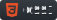
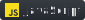
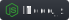
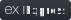

<h1 align="center"> Рад видеть!👋</h1>
<h2 align="center"> Меня зовут Александр,  и я профессиональный Веб-разработчик в ближайшей перспективе!</h2>
<ul style="display: flex">
  <li>🔭 В настоящее время я работаю над рабочим pet-проектом</li>
  <li>👯 совершенствую и закрепляю знания на новых курсах по профессии</li>
  <li>🌱 Изучаю новые возможности Reacta  (сейчас проверка почты и телефона при регистрации, дальше возможности оплаты)</li>
  <li>🤔 Стремлюсь к красивому коду</li>
  <li>💬 Хочу разиваться под началом опытного наставника</li>

<!-- - 📫 How to reach me: ...
- 😄 Pronouns: ...
- ⚡ Fun fact: ... -->
</ul>
<h2> Мой стек:</h2>
<h1 align="center" font-size="30px">
  &nbsp;&nbsp;&nbsp;&nbsp;
  &nbsp;&nbsp;&nbsp;&nbsp;
  &nbsp;&nbsp;&nbsp;&nbsp;
  &nbsp;&nbsp;&nbsp;&nbsp;
  &nbsp;&nbsp;&nbsp;&nbsp;
  &nbsp;&nbsp;&nbsp;&nbsp;
  &nbsp;&nbsp;&nbsp;&nbsp;
  &nbsp;&nbsp;&nbsp;&nbsp;
  &nbsp;
</h1>
<!-- <ul>
  <li>HTML5</li>
  <li>CSS3</li>
  <li>JS</li>
  <li>React</li>
  <li>Node.js</li>
  <li>Express</li>
  <li>MangoDB</li>
  <li>Figma</li>
  <li>VS_Code</li>
  <li></li>
</ul> -->

<h2>Мои контакты:</h2>

  &nbsp;&nbsp;&nbsp;&nbsp;&nbsp;
  &nbsp;&nbsp;&nbsp;&nbsp;&nbsp;
  <a href="https://mail.yandex.ru/?uid=891167374#inbox">&nbsp;</a>

<!-- 
Tg: @alix1982_tg;

Email: alix1982@yandex.ru
 -->

<h2>Статистика GitHub</h2>

  

  

